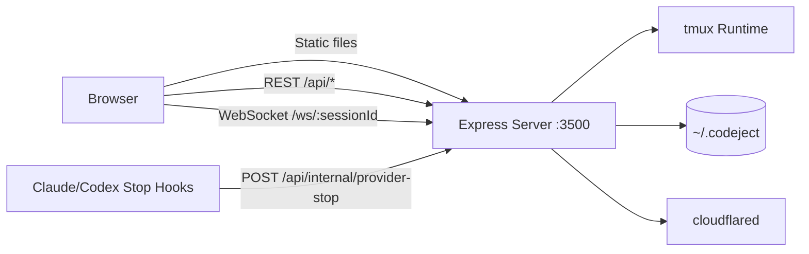
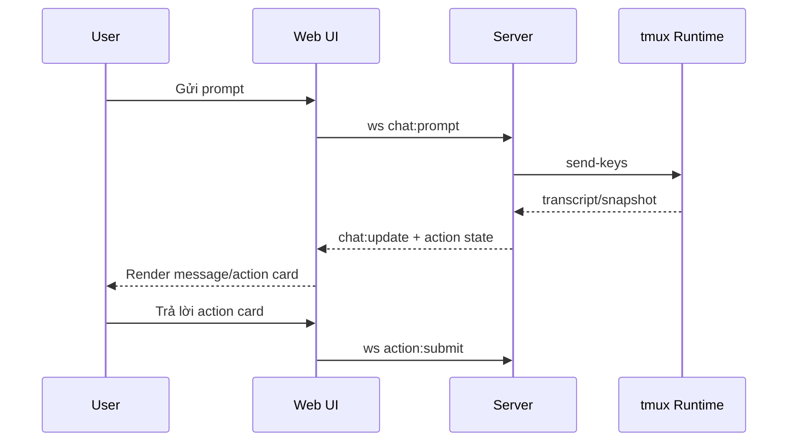
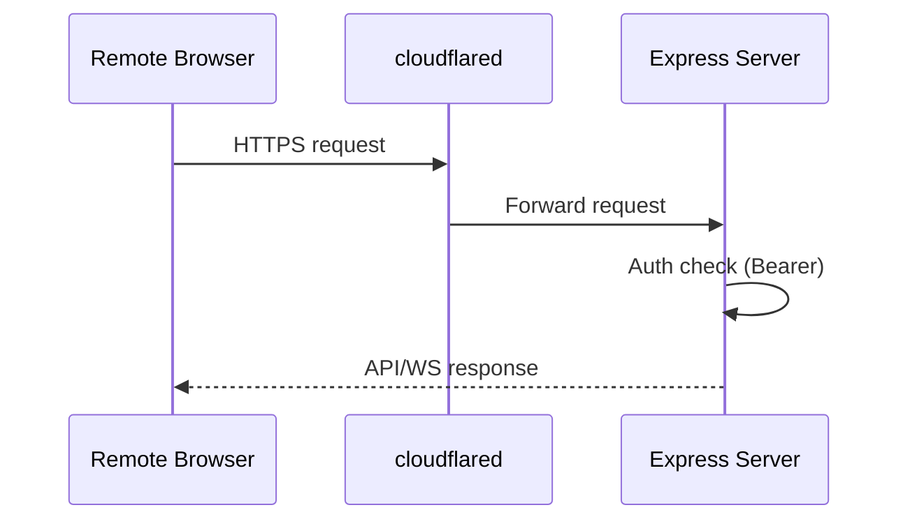
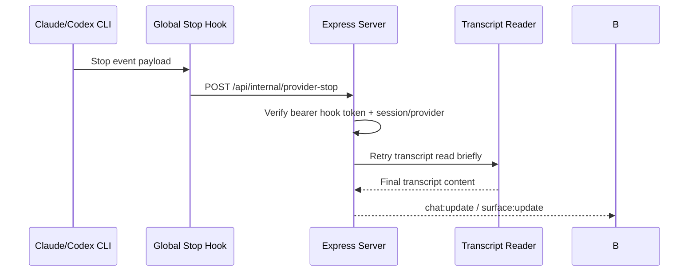

# Kiến trúc

Codeject ưu tiên trải nghiệm mobile-first nhưng vẫn giữ runtime thật trên máy host để tránh phụ thuộc hạ tầng cloud. Thiết kế này giảm độ trễ thao tác và giúp kiểm soát dữ liệu tốt hơn. Mọi thành phần đều xoay quanh một server Express duy nhất làm gateway cho static web, REST, và WebSocket.

## Tổng quan

## Thành phần chính

| Package | Vai trò | Công nghệ | Kết nối chính |
|---|---|---|---|
| `packages/codeject-cli` | CLI quản trị hook toàn máy: `install`, `status`, `repair`, `uninstall` | Node.js, Bash templates | `~/.claude/settings.json`, `~/.codex/config.toml`, `~/.codex/hooks.json`, `~/.codeject` |
| `packages/web` | UI mobile-first, chat surface, action cards, terminal tab nhẹ | Next.js 16, React 19, Zustand, Tailwind CSS 4 | `/api/*`, `/ws/:sessionId` |
| `packages/server` | Serve static, API, auth, persistence, websocket, tunnel orchestration | Express 5, ws, tmux, cloudflared | `packages/web`, `packages/shared`, `~/.codeject` |
| `packages/shared` | Hợp đồng kiểu dữ liệu và schema runtime | TypeScript, Zod | Web + Server |

## Luồng dữ liệu

### Chat flow

### Remote access flow

### Stop-hook acceleration flow

## Lưu trữ

| Dữ liệu | Vị trí | Định dạng |
|---|---|---|
| Cấu hình ứng dụng | `~/.codeject/config.json` | JSON |
| Install state | `~/.codeject/install-state.json` | JSON |
| Danh sách session | `~/.codeject/sessions/*.json` | JSON |
| Scrollback terminal | tmux history | Runtime buffer |
| Tuỳ chọn UI (`fontSize`, `accentColor`, `notifications`) | Browser storage | LocalStorage |
| Bearer key cho thiết bị remote | Browser storage từng thiết bị | LocalStorage |

## Auth

Request local được bỏ qua auth để thao tác nhanh trên máy host. Request non-local bắt buộc dùng `Authorization: Bearer <key>`. WebSocket non-local dùng query `?token=<key>` trên `/ws/:sessionId`.

## Ràng buộc hệ thống

1. Host bắt buộc cài `tmux`.
2. Remote access cần `cloudflared`.
3. Terminal tab là snapshot + input nhẹ, chưa phải emulator đầy đủ.
4. `Claude Code` và `OpenAI Codex` render theo final-only transcript.
5. Opaque arrow-key flow hoặc full-screen TUI có thể cần thao tác trực tiếp ở host.
6. Global hook wrappers chỉ dùng stop signal để tăng tốc settle transcript; final assistant text vẫn chỉ lấy từ transcript.

## Key source files

| Nếu sửa | File nên đọc trước |
|---|---|
| Hook installer CLI | `packages/codeject-cli/src/index.ts`, `packages/codeject-cli/src/commands/*.ts`, `packages/codeject-cli/src/providers/*.ts` |
| WebSocket contract | `packages/shared/src/schemas.ts`, `packages/shared/src/types.ts` |
| WS handler server | `packages/server/src/websocket/websocket-handler.ts` |
| WS client web | `packages/web/src/lib/websocket-client.ts` |
| Chat runtime hook | `packages/web/src/hooks/use-hybrid-session.ts` |
| Notification | `packages/web/src/hooks/use-chat-notifications.ts`, `packages/web/src/lib/notification-service.ts` |
| Remote access | `packages/server/src/services/tunnel-manager.ts`, `packages/web/src/hooks/use-remote-access-settings.ts` |
