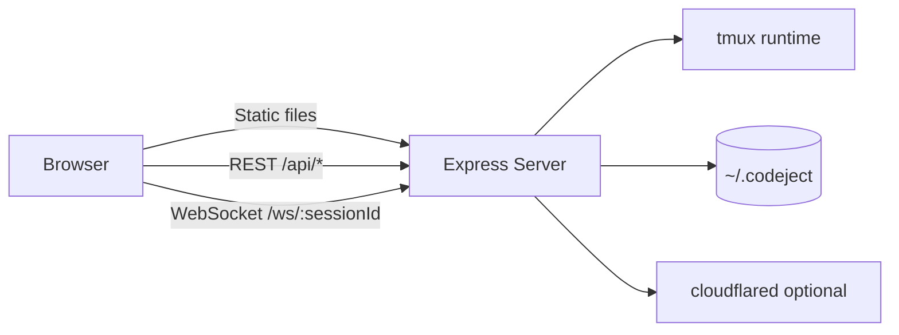
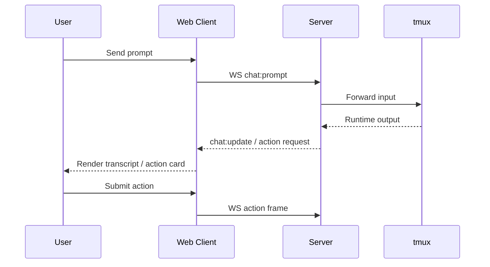
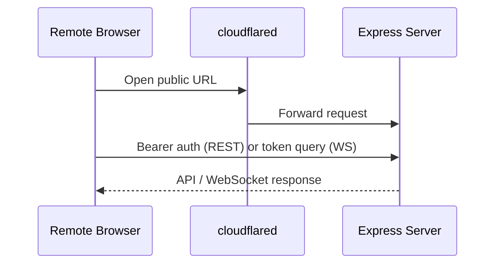

# Architecture

Codeject keeps assistant runtimes on the host and exposes a mobile-first web surface for prompt, approval, and session control. The architecture optimizes for reliable chat-first interaction before falling back to direct terminal input.

## Overview

## Components

| Package | Role | Tech | Talks to |
|---|---|---|---|
| `packages/web` | Mobile-first UI for session list, chat, settings, terminal tab | Next.js 16, React 19, Zustand | `packages/server`, `packages/shared` |
| `packages/server` | API, WebSocket, auth, persistence, runtime orchestration | Express 5, ws, tmux, cloudflared | `packages/web`, `packages/shared`, filesystem |
| `packages/shared` | Shared wire types and schema validation | TypeScript, Zod | `packages/web`, `packages/server` |

## Data Flow

### Chat flow

### Remote access flow

## Persistence

| What | Where | Format |
|---|---|---|
| App config | `~/.codeject/config.json` | JSON |
| Sessions | `~/.codeject/sessions/*.json` | JSON |
| Terminal history | tmux | tmux scrollback |
| UI preferences | Browser storage | localStorage |

## Auth

Local requests bypass auth. Non-local REST requests require `Authorization: Bearer <key>`, and non-local WebSocket requests use `?token=<key>`.

## Constraints

1. `tmux` is required on host.
2. Remote access requires `cloudflared`.
3. Terminal tab is snapshot + input, not full terminal emulation.
4. Assistant rendering for Claude/Codex is final-answer-first.
5. Browser notifications depend on device/browser permission support.

## Key Source Files

| If you change | Read first |
|---|---|
| WebSocket wire contracts | `packages/shared/src/schemas.ts`, `packages/shared/src/types.ts` |
| WebSocket runtime handling | `packages/server/src/websocket/websocket-handler.ts`, `packages/web/src/lib/websocket-client.ts` |
| Chat/session orchestration | `packages/web/src/hooks/use-hybrid-session.ts` |
| Notifications | `packages/web/src/hooks/use-chat-notifications.ts`, `packages/web/src/lib/notification-service.ts` |
| Remote access | `packages/server/src/services/tunnel-manager.ts`, `packages/web/src/hooks/use-remote-access-settings.ts` |
